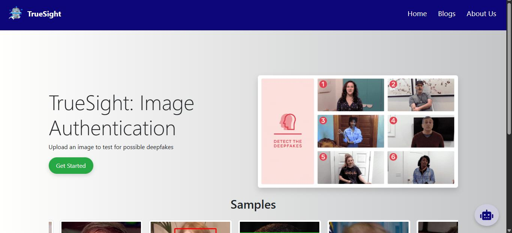
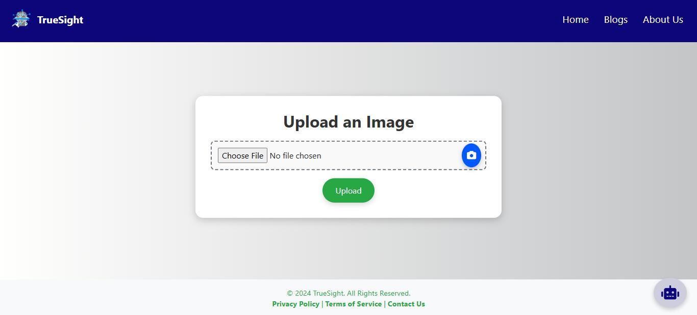
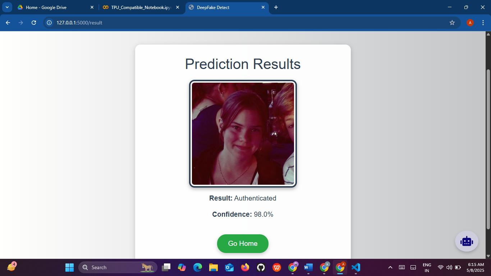
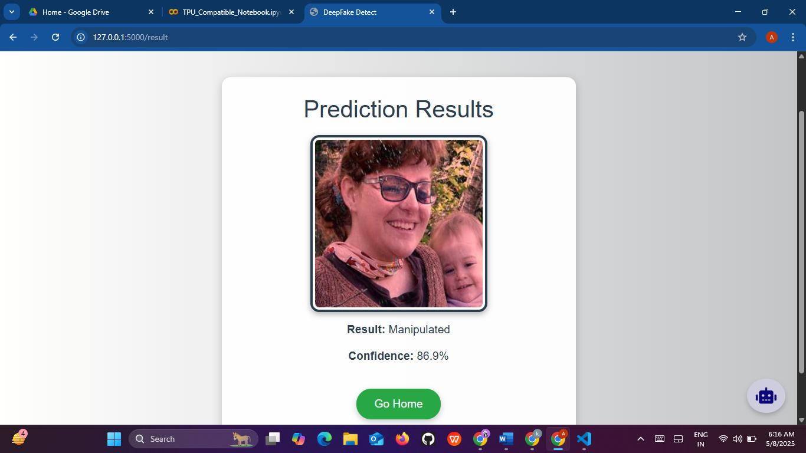
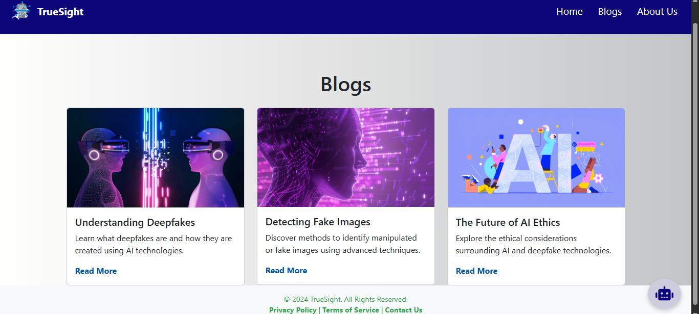

# TrueSight — Deepfake Image Detection

A Flask web app ("TrueSight") that lets a user upload an image and get a prediction on whether it's authentic or a manipulated/deepfake image, using a fine-tuned Hugging Face image classification model. This is a personal project exploring deepfake detection end-to-end, from model inference to a simple web UI.

## Tech Stack


## Overview

The app loads a fine-tuned image classification model ("finetuned-deepfake-detector") through Hugging Face's `transformers` library (`AutoImageProcessor` + `AutoModelForImageClassification`) and runs inference with PyTorch. When a user uploads an image, it's preprocessed with the model's processor, passed through the model, and the softmax output is used to report a predicted label (e.g. real/manipulated) along with a confidence percentage.

## Features

- Image upload through a browser UI (Flask + Jinja templates)
- Deepfake/real classification via a fine-tuned Hugging Face image model
- Confidence score displayed alongside the prediction
- Result page showing the uploaded image, predicted label, and confidence
- Extra static pages: Home, About Us, Blogs

## Getting Started

There's no `requirements.txt` in this repo. Based on the imports in `app.py`, you'll need:

```bash
pip install flask torch transformers pillow
```

You'll also need the fine-tuned model referenced in `app.py` (`finetuned-deepfake-detector`) available locally or on the Hugging Face Hub.

Then run:

```bash
python app.py
```

The app will be available at `http://127.0.0.1:5000`.

Notes:
- `static.7z` and `templates.7z` contain the app's static assets and HTML templates in compressed form.
- `Dataset.zip` / `images.zip` contain sample/training images used during development.

## Screenshots

| Home | Upload |
|---|---|
|  |  |

| Result — Authenticated | Result — Manipulated |
|---|---|
|  |  |


